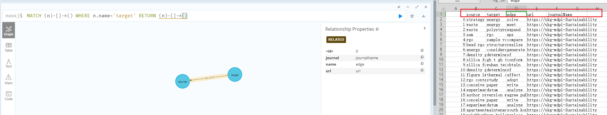

## MDS

### Build & Run
The build and run process is based on `docker`.  
Make sure you have `docker-desktop` installed.  

1. Build and run frontend, backend, neo4j using Docker
> Windows  
```
Double click run-windows.bat
```

> Linux or MacOS  
```
$ sudo ./run-linux.sh
```

2. Import csv to neo4j
> Open [`http://localhost:7474/`](http://localhost:7474/) and run script below
```cypher
LOAD CSV FROM 'file:///data.csv' AS line
MERGE (n:Entity {name : line[1]})
WITH line, n
MERGE (m:Entity {name : line[2]})
WITH m,n,line[3] as relName, line[4] as urlName, line[5] as jName
MERGE (m)-[rel1:RELATED{name:relName, url:urlName, journal:jName}]->(n);
```

Done.
Website url: [`http://localhost`](http://localhost)

#### FAQ
1. Why the index page has no graph data?
    > Please do Step `2. Import csv to neo4j` above first.

2. Do I have to run Step 2 every time?
    > No, the folder `/neo4j/data` will be generated after the first import.

3. How to monitor or stop running this project?
    > Use `docker-desktop` for friendly control and view the output of each container run.

4. How to change the graph data display limitations?
    > Please edit the python file `/backend/app.py` line 79 & 98.

#### Bug report

> The first line as the csv header should not be loaded into the database and should be deleted.